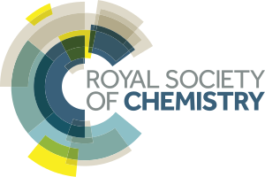

---?color=linear-gradient(to bottom, #ffffff, #dddddd)
Share your pictures

https://photos.app.goo.gl/xNHfYh2xCt5k3DmL8

Print boarding passes

---?color=linear-gradient(to bottom, #ffffff, #dddddd)

@snap[north-east]
Funders and Industry
@snapend

---?color=linear-gradient(to bottom, #ffffff, #dddddd)
@snap[north-east]
Networking and Tea
@snapend

- Lots of *exciting* work in India and the UK
- Hope you already talked to lots of people
- Time to preserve the sparks of your ideas

@snap[south span-100]
**Generate one slide to caputure the core of your collaborative idea**
@snapend

---?color=linear-gradient(to bottom, #ffffff, #dddddd)
@snap[north-east]
Conclusion
@snapend

- Present collaborative ideas
- Conclude the workshop

@snap[south span-100]
**Reconvene here at 5pm**
@snapend

---?color=linear-gradient(to bottom, #ffffff, #dddddd)

It's the **beginning**, not the end!
